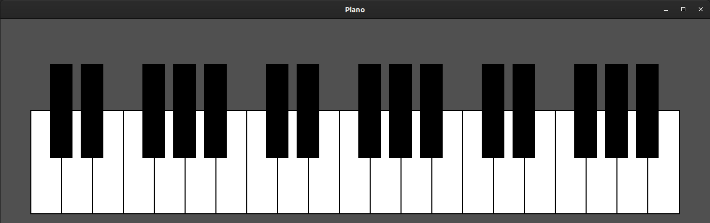

# Piano

## General Info
- I like playing the Piano, and often indulge in it
- The frequemcy of the different notes was obtained from <a href="https://pages.mtu.edu/~suits/notefreqs.html">here</a>
- This is just an arrow I shot in the dark to see what all I might be able to do, so some features are yet to be implemented, and I'll be working on them soon..
- Any changes / updates you'd like to see, open up an Issue :)

## Setup
My setup was on Ubuntu 20.04. To download SFML, run:

```sh
sudo apt update
sudo apt upgrade
sudo apt install libsfml-dev
```

Now, in order to run the application, navigate into this directory and run the following commands:
```sh
chmod +x ./run.sh
./run.sh
```

## Instructions
- Change the sound file path in `./include/config.h` to the required path
- Hit `SPACE` to stop playing everything
- Playing the piano is simple, refer the images below:

| OCTAVE | KEYS |
| ------ | ---- |
| Lower  |  |
| Middle |  |
| Higher |  |

## Preview
Well, this is how it looks:

